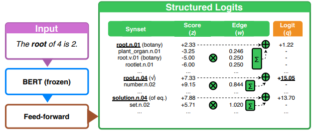
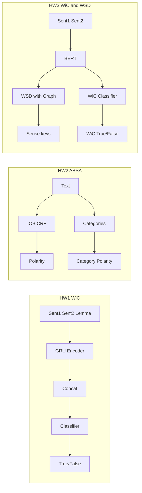

<p align="center">
  
</p>

<p align="center">
  
  
  
  
</p>

Three assignments from the **Natural Language Processing** course at Sapienza University of Rome (A.Y. 2020-2021), instructed by **Roberto Navigli**. This repository contains implementations for **Words in Context (WiC)**, **Aspect-Based Sentiment Analysis (ABSA)**, and **Word Sense Disambiguation (WSD)** combined with WiC, using neural models and knowledge-graph enhancements.

**Course**: [NLP @ Sapienza (Navigli)](http://naviglinlp.blogspot.com/)

## Quick navigation

- [Overview](#overview)
- [Project 1 - Words in Context (WiC) - HW1](#project-1---words-in-context-wic---hw1)
- [Project 2 - Aspect-Based Sentiment Analysis (ABSA) - HW2](#project-2---aspect-based-sentiment-analysis-absa---hw2)
- [Project 3 - WiC + WSD (graph-based over WordNet) - HW3](#project-3---wic--wsd-graph-based-over-wordnet---hw3)
- [Datasets and evaluation](#datasets-and-evaluation)
- [High-level architecture (Mermaid)](#high-level-architecture-mermaid)
- [References](#references)

---

## Overview

| Project | Task(s) | Main idea | Data / evaluation |
|---------|---------|-----------|-------------------|
| **HW1** | WiC (binary) | Decide if the target word has the **same sense** in two sentences (True/False). | WiC-style JSONL (sentence pairs + lemma + spans). |
| **HW2** | ABSA a,b,c,d | **Aspect term** extraction + sentiment; **aspect category** identification + sentiment. | SemEval-2014 Task 4 (restaurants, laptops). |
| **HW3** | WiC + WSD | Same-sense decision **and** WordNet **sense keys** for both contexts. | JSONL + `dev_wsd.txt` (gold sense keys). |

---

## Project 1 - Words in Context (WiC) - HW1

### Problem

- **Input**: Two sentences, a target **lemma**, character spans (`start1,end1`, `start2,end2`) for the word in each sentence, and POS.
- **Output**: **True** if the target is used in the **same sense** in both sentences, **False** otherwise.

### Examples (from the dataset)

| Sentence 1 | Sentence 2 | Lemma | Label | Explanation |
|------------|------------|-------|-------|-------------|
| Bolivia holds a key **play** in any process of infrastructure development. | A musical **play** on the same subject was staged in Kathmandu. | play | **False** | "play" = strategic move vs. theatrical performance. |
| We convey our **esteem** and congratulations to Lebanon. | The UN has a special place in the affections and **esteem** of the people of Vanuatu. | esteem | **True** | Same sense: respect/admiration. |
| The Units have recreation, including television, **reading** and exercise. | The conclusion of the first **reading** would make negotiations possible. | reading | **False** | "reading" = activity vs. procedural stage. |
| Protection of the child called for a **healthy** socio-economic environment. | To live a long and **healthy** life. | healthy | **False** | "healthy" = conducive to health vs. in good health. |

### Solution

- **Model** ([nlp2021-hw1/hw1/stud/implementation.py](nlp2021-hw1/hw1/stud/implementation.py)): **StudentModel** uses a 300-dim embedding layer (GloVe-style, 400K vocab), a **2-layer GRU** (hidden 256) whose input is the embedding plus a one-hot encoding of the lemma position. The two sentences are encoded separately (split at `<sep>`); the **last hidden states** of the GRU for each sentence are concatenated and passed through BatchNorm, dropout, and two linear layers to produce a single logit (BCE loss). At training time, optional **dropword** and **Gaussian noise** on embeddings improve robustness.
- **Preprocessing**: NLTK tokenization, universal POS, stopword removal, and custom text cleaning; reserved tokens `<pad>`, `<unk>`, `<sep>`, `<drop>`, etc.
- **Training**: [nlp2021-hw1/hw1/stud/train.ipynb](nlp2021-hw1/hw1/stud/train.ipynb) loads GloVe, builds the vocabulary from the training data, and trains the above architecture. The served checkpoint is `model/best-gru2-parameters-.697.pt`.

### Results

Detailed metrics and training curves are in [nlp2021-hw1/report.pdf](nlp2021-hw1/report.pdf). The checkpoint name indicates a dev accuracy around 69.7% for the binary WiC task.

### How to run

See [nlp2021-hw1/README.md](nlp2021-hw1/README.md) for environment setup (Docker, conda). From the project root:

```bash
cd nlp2021-hw1
conda activate nlp2021-hw1
bash test.sh data/dev.jsonl
```

---

## Project 2 - Aspect-Based Sentiment Analysis (ABSA) - HW2

### Problem

ABSA is split into four subtasks (SemEval-2014 Task 4):

- **(a)** **Aspect term extraction**: IOB tagging of aspect spans in the text.
- **(b)** **Aspect term sentiment**: For each extracted term, classify polarity (positive / negative / neutral / conflict).
- **(c)** **Aspect category identification**: Multi-label prediction over categories (anecdotes/miscellaneous, price, food, ambience, service).
- **(d)** **Aspect category sentiment**: For each category present, predict its polarity.

### Examples (from the data)

| Input | Output (targets) | Output (categories) |
|-------|------------------|---------------------|
| I love their **pasta** but I hate their **Ananas Pizza**. | (pasta, positive), (Ananas Pizza, negative) | (food, conflict) |
| The friendly and helpful **staff** was just Fantastic. | (staff, positive) | (service, positive) |
| One of the more authentic Shanghainese restaurants in the US. | - | (anecdotes/miscellaneous, positive) |

### Solution

The pipeline ([nlp2021-hw2/hw2/stud/implementation.py](nlp2021-hw2/hw2/stud/implementation.py)) wraps **ABSADB** from [nlp2021-hw2/hw2/stud/train.py](nlp2021-hw2/hw2/stud/train.py):

- **(a) IOB (IOBDB)**: **DistilBERT** -> **BiLSTM** -> **CRF** for IOB tagging. Optional special tokens for aspect spans.
- **(b) Polarity (POLDB)**: **DistilBERT** with **[AS]** and **[AE]** tokens around each aspect span; the hidden states at these positions are concatenated and passed through LayerNorm, linear layers, and GELU to predict polarity.
- **(c) Categories (CATDB)**: **DistilBERT** [CLS] representation -> linear stack -> **sigmoid** for multi-label category prediction.
- **(d) Category sentiment (CATPOLDB)**: **DistilBERT** [CLS] -> a **parallel set of classifiers** (one per category) -> softmax over polarities for each category.

Data handling uses a `Sample` dataclass, IOB/offset mapping, and task-specific collate functions. Training uses PyTorch Lightning on SemEval-14 restaurants (with categories) and laptops data.

### Results

F1 scores and training/validation plots are in [nlp2021-hw2/report.pdf](nlp2021-hw2/report.pdf). Saved training figures (e.g. `a_1.png`, `a_2.png`, `b.png`, `c_*.png`, `d.png`) are under [nlp2021-hw2/model/](nlp2021-hw2/model/).

### How to run

See [nlp2021-hw2/README.md](nlp2021-hw2/README.md). Example:

```bash
cd nlp2021-hw2
conda activate nlp2021-hw2
bash test.sh data/restaurants_dev.json
```

---

## Project 3 - WiC + WSD (graph-based over WordNet) - HW3

### Problem

- **Input**: Same as HW1 (sentence pairs + lemma + character spans + POS).
- **Outputs**:
  - **WiC**: Same sense in both sentences? (True/False).
  - **WSD**: For each sentence, a **WordNet sense key** (e.g. `superior%1:18:01::`) for the target word.

### Example

From [nlp2021-hw3/data/dev.jsonl](nlp2021-hw3/data/dev.jsonl) and [nlp2021-hw3/data/dev_wsd.txt](nlp2021-hw3/data/dev_wsd.txt):

- **dev.0**: "responsibility of **superiors** under international law" vs "bishops and major **superiors** of religious institutes" -> WiC **False**. Gold sense keys: `superior%1:18:01::` (sentence 1), `superior%1:18:02::` (sentence 2).
- **dev.1**: Same sentence 1 vs "the customs officer and his **superiors** receive a premium" -> WiC **True**. Gold: both `superior%1:18:01::`.
- **dev.4**: "**baggage** of any passenger" vs "In my **baggage** I had a Hungarian grammar" -> WiC **True**. Gold: both `baggage%1:06:00::`.

### Solution - graph-based WSD

The implementation ([nlp2021-hw3/hw3/stud/wsdwic.py](nlp2021-hw3/hw3/stud/wsdwic.py), [nlp2021-hw3/hw3/stud/implementation.py](nlp2021-hw3/hw3/stud/implementation.py)):

- **WSD branch**: **BERT** (e.g. `bert-large-uncased`) encodes the sentence with the target word marked; the **contextualized representation of the target** is extracted (mean over subword pieces). Then: BatchNorm -> Linear -> SiLU -> Linear -> synset logits. A **graph module** encodes WordNet structure: the vocabulary is the set of WordNet synsets; an **adjacency matrix** is built from **hyponym** and **hypernym** relations (depth 1) via NLTK WordNet. This is implemented as a **SparseLinear** layer with fixed connectivity: `logits = adjacency(out) + out`, so predictions are refined using neighbouring synsets. A **synset mask** restricts outputs to senses valid for the lemma and POS. This design is inspired by **integrating lexical knowledge base (LKB) graph structure into the WSD classifier**, as in Bevilacqua & Navigli (2020).
- **WiC branch**: Two WSD forward passes (one per sentence) yield two hidden representations (the "act" vectors before the final WSD logits). These are concatenated -> Linear -> SiLU -> BatchNorm -> Linear -> single logit -> sigmoid for the WiC binary prediction.
- **Training**: Joint WSD + WiC in [nlp2021-hw3/hw3/stud/trainwsdwic.ipynb](nlp2021-hw3/hw3/stud/trainwsdwic.ipynb); WSD-only in [nlp2021-hw3/hw3/stud/trainwsd.ipynb](nlp2021-hw3/hw3/stud/trainwsd.ipynb). Checkpoint: `model/wic-wsd-epoch=09-wic_val_Accuracy=0.67.ckpt`.

### Inspiration: Bevilacqua & Navigli (2020)

The HW3 WSD model incorporates **knowledge graph (WordNet) structure** inside the neural classifier via a sparse adjacency layer over synsets, in the spirit of:

**Michele Bevilacqua and Roberto Navigli.** 2020. **Breaking Through the 80% Glass Ceiling: Raising the State of the Art in Word Sense Disambiguation by Incorporating Knowledge Graph Information.** In *Proceedings of the 58th Annual Meeting of the Association for Computational Linguistics*, pages 2854-2864, Online. Association for Computational Linguistics.  
URL: [https://aclanthology.org/2020.acl-main.255/](https://aclanthology.org/2020.acl-main.255/)

That work proposes **EWISER**, which embeds LKB graph information and synset embeddings into the architecture to improve WSD; here we use a WordNet hypo/hyper adjacency matrix (SparseLinear) to propagate information over the synset graph.

The figure below (from Bevilacqua & Navigli, 2020) illustrates the idea of integrating the LKB graph into the WSD model. You can add a cropped figure from the paper into [nlp2021-hw3/images/](nlp2021-hw3/images/) and reference it here.



*Figure from Bevilacqua & Navigli (2020), ACL. Used for illustrative purposes.*

*(To complete: crop the desired figure from the [ACL PDF](https://aclanthology.org/2020.acl-main.255.pdf), save it as `nlp2021-hw3/images/bevilacqua-navigli-2020-fig.png`, and keep the caption above.)*

### Results

WiC accuracy and WSD metrics are reported in [nlp2021-hw3/report.pdf](nlp2021-hw3/report.pdf). The checkpoint name indicates WiC validation accuracy ~67% at epoch 9.

### How to run

See [nlp2021-hw3/README.md](nlp2021-hw3/README.md).

- WiC only:
  ```bash
  cd nlp2021-hw3
  conda activate nlp2021-hw3
  bash test.sh data/dev.jsonl
  ```
- WiC + WSD:
  ```bash
  bash test.sh data/dev.jsonl data/dev_wsd.txt
  ```

---

## Datasets and evaluation

- **HW1 / HW3 (WiC)**: JSONL with `id`, `lemma`, `pos`, `sentence1`, `sentence2`, `start1`, `end1`, `start2`, `end2`, `label` (WiC True/False). HW3 also uses **dev_wsd.txt**, with one line per (sample, sentence): e.g. `dev.0.s1 superior%1:18:01::` for gold sense keys.
- **HW2 (ABSA)**: JSON with `text`, `targets` (list of `[[start, end], term, polarity]`), and `categories` (list of `(category, polarity)`). Domains: restaurants (with categories) and laptops.

Exact metrics, tables, and plots are in the respective **report.pdf** files in each project folder.

---

## High-level architecture (Mermaid)



---

## References

- **Bevilacqua, M., & Navigli, R.** (2020). Breaking Through the 80% Glass Ceiling: Raising the State of the Art in Word Sense Disambiguation by Incorporating Knowledge Graph Information. *ACL*, 2854-2864. [https://aclanthology.org/2020.acl-main.255/](https://aclanthology.org/2020.acl-main.255/)
- **Pontiki, M., et al.** (2014). SemEval-2014 Task 4: Aspect Based Sentiment Analysis. *SemEval*, 27-35. (SemEval-2014 Task 4 - ABSA.)
- **Pilehvar, M. T., & Camacho-Collados, J.** (2019). WiC: the Word-in-Context Dataset for Evaluating Context-Sensitive Meaning Representations. *NAACL*, 1267-1273. (WiC dataset.)
